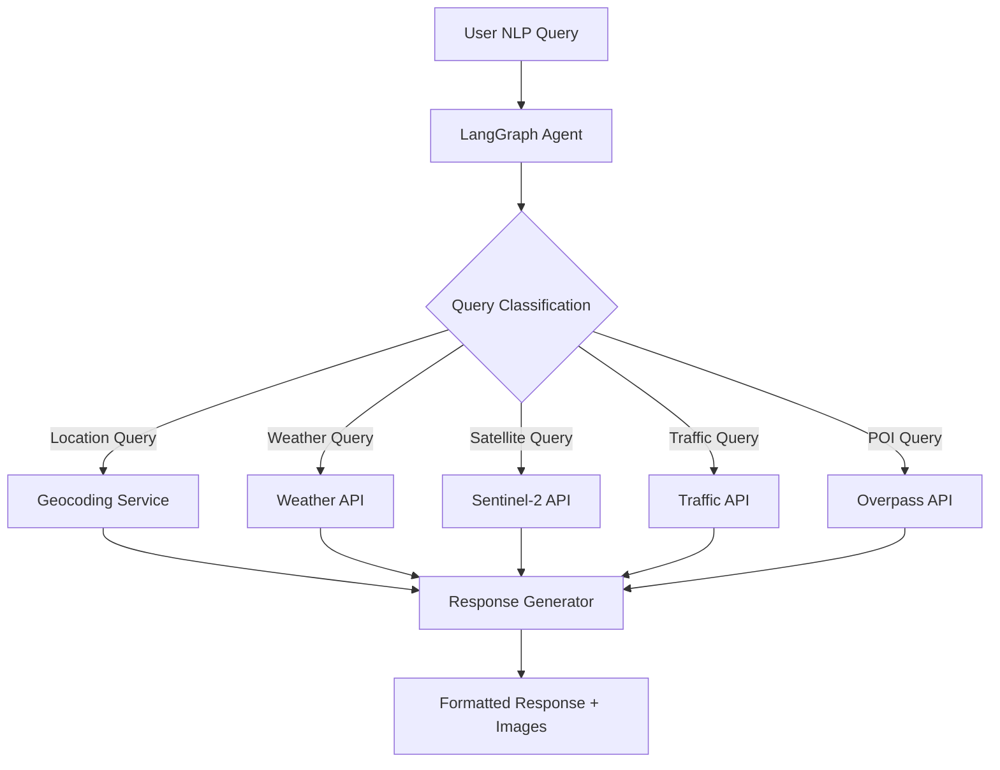
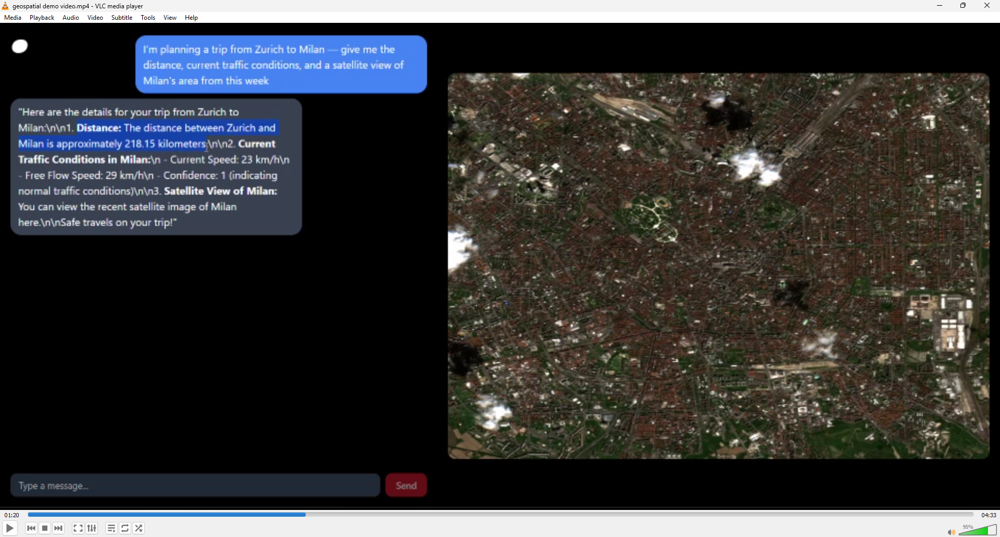
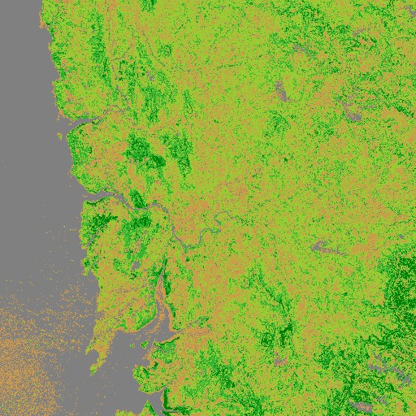
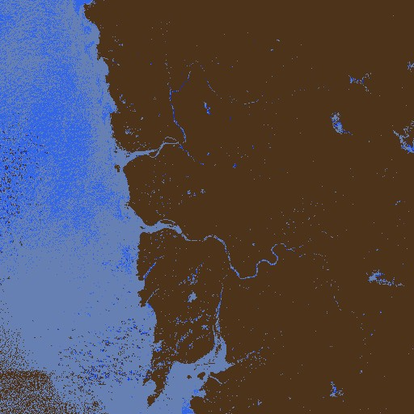
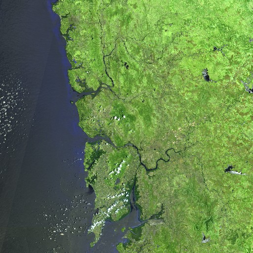

# 🌍 Geospatial Data Retrieval Agent

An intelligent natural language processing system that transforms user queries into comprehensive geospatial insights, featuring real-time satellite imagery analysis, weather data, traffic information, and environmental monitoring.


## 📋 Table of Contents

- [Overview](#overview)
- [Key Features](#key-features)
- [Architecture](#architecture)
- [Installation](#installation)
- [Usage](#usage)
- [API Endpoints](#api-endpoints)
- [Supported Queries](#supported-queries)
- [Demo Images](#demo-images)
- [Technical Stack](#technical-stack)
- [Configuration](#configuration)
- [Contributing](#contributing)
- [License](#license)

## 🎯 Overview

The Geospatial Data Retrieval Agent is an advanced AI-powered system that processes natural language queries about geographic locations and provides comprehensive insights including:

- **Real-time satellite imagery** from Sentinel-2 satellites
- **Weather forecasting** with current conditions
- **Traffic analysis** and congestion data
- **Elevation and topographic information**
- **Points of Interest (POIs)** discovery
- **Administrative boundary identification**
- **Specialized satellite analysis** (vegetation, water detection, urban mapping, etc.)


## ✨ Key Features

### 🛰️ Satellite Imagery Analysis
- **Multi-spectral Analysis**: True color, vegetation (NDVI), water detection, moisture analysis
- **Urban Development Monitoring**: Built-up area detection and urban sprawl analysis  
- **Environmental Monitoring**: Cloud coverage, snow detection, flood monitoring
- **High-resolution Imagery**: 1024x1024 pixel satellite images with customizable zoom levels

### 🌦️ Weather & Environmental Data
- Real-time weather conditions and forecasts
- Temperature, humidity, and atmospheric data
- Integration with OpenWeatherMap API

### 🚗 Traffic Intelligence  
- Live traffic congestion analysis
- Speed monitoring and flow assessment
- Route optimization insights

### 📍 Location Intelligence
- Coordinate conversion (place names ↔ lat/lng)
- Administrative boundary detection
- Elevation and topographic data
- Distance calculations using Haversine formula

### 🏢 Points of Interest Discovery
- Nearby amenities (hospitals, restaurants, schools)
- Tourism and landmark identification
- Business and service location mapping

## 🏗️ Architecture



The system utilizes **LangGraph** for intelligent agent orchestration, enabling dynamic tool selection based on user intent recognition.

## 🚀 Installation

### Prerequisites
- Python 3.8+
- FastAPI
- LangChain/LangGraph
- OpenAI API access
- Various API keys (see Configuration)

### Clone Repository
```bash
git clone https://github.com/Priteshverma123/Geospatial-Data-Retrieval-Agent.git
cd Geospatial-Data-Retrieval-Agent
```

### Install Dependencies
```bash
pip install -r requirements.txt
```

### Environment Setup
Create a `.env` file with required API keys:
```env
OPENAI_API_KEY=your_openai_key
SENTINEL_HUB_CLIENT_ID=your_sentinel_hub_client_id
SENTINEL_HUB_CLIENT_SECRET=your_sentinel_hub_client_secret
OPENWEATHER_API_KEY=your_openweather_key
TOMTOM_API_KEY=your_tomtom_key
OPENCAGE_API_KEY=your_opencage_key
NEWS_API_KEY=your_news_api_key
```

## 💻 Usage

### Start the Server
```bash
python main.py
```
The server will start on `http://127.0.0.1:8000`

### Example Queries

#### Weather Analysis
```
"What's the current weather in Mumbai and show me a satellite image of the area?"
```

#### Vegetation Monitoring
```
"Show me vegetation coverage around Mount Everest from April 2025"
```

#### Urban Development
```
"Get me urban area detection for New York City with recent satellite data"
```

#### Traffic Analysis
```
"What's the traffic situation near Times Square right now?"
```



## 🔌 API Endpoints

### Main Agent Endpoint
```http
POST /api/agent
Content-Type: application/json

{
    "query": "Show me vegetation analysis for London from last month"
}
```

### Satellite Image Retrieval
```http
GET /api/satellite-image
```
Returns the most recently generated satellite image.

### Marketing Email Generation
```http
POST /api/generate-email
Content-Type: multipart/form-data

files: [uploaded_files]
topic: "email_topic"
recipient_type: "target_audience"
```

## 📊 Supported Queries

### 🛰️ Satellite Analysis Types

| Layer Type | Description | Use Case |
|------------|-------------|----------|
| `TRUE_COLOR` | Natural RGB composite | General landscape viewing |
| `VEGETATION` | NDVI-based vegetation analysis | Agriculture, forestry monitoring |
| `WATER` | Water body detection | Flood monitoring, water resource management |
| `MOISTURE` | Soil and vegetation moisture | Drought assessment, irrigation planning |
| `URBAN` | Built-up area detection | Urban planning, development tracking |
| `CLOUDS` | Cloud coverage analysis | Weather monitoring, image quality assessment |
| `SNOW` | Snow and ice detection | Climate monitoring, seasonal analysis |

### 🌍 Geographic Operations

- **Coordinate Conversion**: "Convert Mumbai to coordinates"
- **Distance Calculation**: "Distance between Delhi and Bangalore"  
- **Elevation Queries**: "What's the elevation of Mount Everest?"
- **Administrative Boundaries**: "Which state is this coordinate in?"
- **POI Discovery**: "Find hospitals near this location"

## 📸 Demo Images

### Satellite Imagery Analysis

*NDVI vegetation analysis showing healthy crop areas in green*

  
*Water body detection highlighting rivers and lakes in blue*


*Urban area detection showing built-up regions*


### Traffic Analysis

*Live traffic congestion data visualization*

## 🛠️ Technical Stack

### Backend Framework
- **FastAPI**: High-performance web framework
- **LangGraph**: Agent orchestration and workflow management
- **LangChain**: LLM integration and tool management

### AI & Machine Learning  
- **OpenAI GPT-4**: Natural language understanding
- **Custom Evaluation Scripts**: Satellite image processing algorithms

### Geospatial APIs
- **Sentinel-2 API**: High-resolution satellite imagery
- **OpenStreetMap Nominatim**: Geocoding services
- **Overpass API**: Points of interest data
- **OpenWeatherMap**: Weather data
- **TomTom**: Traffic information
- **OpenCage**: Administrative boundaries

### Data Processing
- **NumPy/Pandas**: Data manipulation
- **Requests**: API integrations
- **PIL/OpenCV**: Image processing

## ⚙️ Configuration

### API Configuration
The system supports multiple environment configurations. Update `utils/config.py`:

```python
config = {
    "development": {
        "LLM_PROVIDER": "openai",
        "LLM_MODEL_NAME": "gpt-4o",
        "TEMPERATURE": 0,
        "CLIENT_ID": "your_sentinel_client_id",
        "CLIENT_SECRET": "your_sentinel_client_secret",
        # ... other API keys
    }
}
```

### Satellite Image Parameters
- **Resolution**: 1024x1024 pixels (configurable)
- **Cloud Coverage**: Maximum 20% (adjustable)
- **Time Range**: 30-day lookback window
- **Zoom Levels**: 0.05 (close-up) to 0.5 (wide area)

## 🤝 Contributing

We welcome contributions! Please see our [Contributing Guidelines](CONTRIBUTING.md) for details.

### Development Setup
1. Fork the repository
2. Create a feature branch (`git checkout -b feature/amazing-feature`)
3. Commit your changes (`git commit -m 'Add amazing feature'`)
4. Push to the branch (`git push origin feature/amazing-feature`)
5. Open a Pull Request

## 📄 License

This project is licensed under the MIT License - see the [LICENSE](LICENSE) file for details.

## 🙏 Acknowledgments

- **European Space Agency (ESA)** for Sentinel-2 satellite data
- **OpenStreetMap** community for geographic data
- **LangChain** team for the excellent agent framework
- **FastAPI** for the robust web framework


---

<div align="center">

**⭐ If you found this project helpful, please give it a star! ⭐**

Made with ❤️ by [Your Name]

</div>